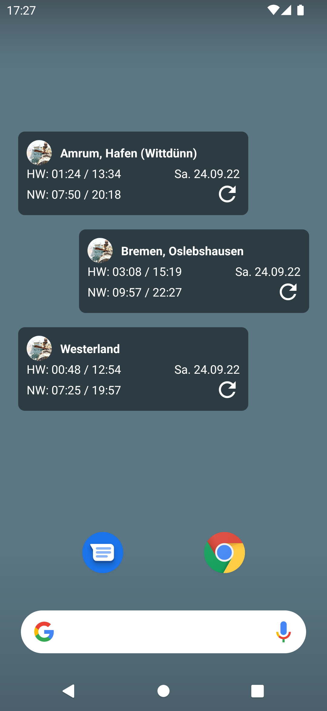
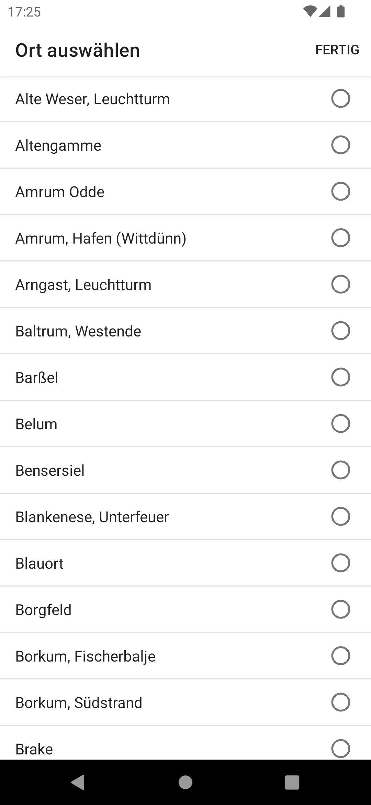

# Wattpaddler Widget
Android homescreen widget to display the tide times at the German North Sea coast.

This widget is a supplement to the 
[Wattpaddler App](https://play.google.com/store/apps/details?id=com.embarcadero.Wattpaddler)
by Steffen Wagner. It uses the same API as the latter. The widget can be used as a stand-alone application and does not require the installation of Steffen Wagner's app.

## Installation
The app is available for download from the Google Play Store:

<https://play.google.com/store/apps/details?id=de.davidaugustat.wattpaddlerwidget>

The app does not have a launcher icon in the app drawer. Instead, long-press on your homescreen to add the widget. You will then be prompted to select a location.

## Screenshots
 

## Project Setup
First clone the repository to your machine.

Then you must specify the API URL prefixes for the locations API and the widget data API, such that
- `[tidesWidgetApiUrl]/?AtPegel=[locationId]&AtDate=[date]` returns the tide times for a given 
`locationId` at a given `date`.  
Example: `https://example.com/locations-api/?AtPegel=510P&AtDate=2022-10-06`
- `[locationsApiUrl]/widgetpegel.csv` returns a CSV-formatted table of all available location IDs 
and their corresponding human-readable names.  
Example: `https://example.com/locations-api/widgetpegel.csv`

To do this, create a file `local.properties` in the root of the repository if it doesn't exist yet. Then
append the following contents to `local.properties`:
```properties
tidesWidgetApiUrl="https://example.com/widget-api"
locationsApiUrl="https://example.com/locations-api"
 ```
Here you have to replace the values with values that match your actual API on your server.

Then open the project in Android Studio and run or build it as usual.

## Description of the API
*Note: The API was NOT designed by me. It already existed and had to be used for the widget. Thus, it is not a fancy JSON API but has a custom format.*

In the following, the two required API endpoints are described. The server-sided code is not part of this repository as it already existed and was not created by me. If you want to use this project, you will have to create the server-sided code yourself.


### Locations API
This API returns a **semicolon**-separated CSV table containing all location names and their corresponding location IDs. An example for an API call is the following:

Requested URL: `https://example.com/locations-api/widgetpegel.csv`

Response:
```
Alte Weser, Leuchtturm;734P
Altengamme;732A
Amrum Odde;622P
Amrum, Hafen (Wittdünn);631P
Arngast, Leuchtturm;773P
Baltrum, Westende;784P
Barßel;816B
Belum;683P
Bensersiel;782P
```

### Widget Data API
This API returns all tide times (low tides and high tides) for a given day at a given location. The times are in CET/CEST which is the time in Germany (CET during winter, CEST during summer --> Daylight Saving Time).

The request contains a location ID (`AtPegel`) which is a valid location ID from the table returned by the locations API (see above). Additionally, a date in `YYYY-MM-DD` format is provided (`AtDate`).

The response must contain all tide times as a separate line in the following format:
```
[Date];[Time];[N/H]
```
where
- `Date` has the `YYYY-MM-DD` format.
- `Time` is in CET/CEST and has the `HH:mm` format.
- `N/H` specifies whether the tide time is a low tide (`N`) or a high tide (`H`).

Note that there are up to four tide times on a day but there may be less if a tide time shifts to the next day or if the location runs dry.

An example for an API call is the following:

Requested URL: `https://example.com/locations-api/?AtPegel=510P&AtDate=2022-10-09`

Response:
```
STARTDATA+
2022-10-09;02:13;H
2022-10-09;08:22;N
2022-10-09;14:28;H
2022-10-09;21:04;N
ENDDATA+
Pegel/Date 510P at 2022-10-09
```
Note that line breaks matter in this format.
